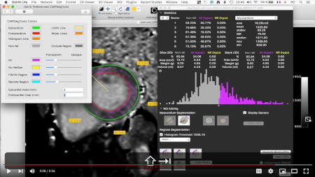
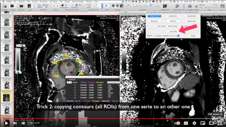
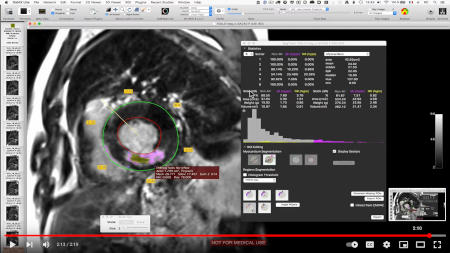

# CMRSegTools 

CMRSegTools is a plug-in for the widely available commercial [OsiriX](https://www.osirix-viewer.com/) and  [Horos](https://horosproject.org/) open-source Horos DICOM viewers. The plug-in is designed to ease cardiac and region segmentation on delayed-enhancement images for infarct quantification.

*CREATIS* - Centre de Recherche en Acquisition et Traitement de l'Image pour la Santé

CNRS UMR 5220 - INSERM U1294 - Université Lyon 1 - INSA Lyon - Université Jean Monnet Saint-Etienne

FRANCE 

# Tutorials

Instructional videos for getting started with CMRSegTools.

### Getting started

### T1, ECV multislice CMR post-processing

### Infarct size quantification

# How to cite

Please cite the CMRSegTools website and the following publication:

Romero R. WA, Viallon M, Spaltenstein J, Petrusca L, Bernard O, Belle L, et al. (2022) CMRSegTools: An open-source software enabling reproducible research in segmentation of acute myocardial infarct in CMR images. PLoS ONE 17(9): e0274491. https://doi.org/10.1371/journal.pone.0274491

# Acknowledgments

This work has been performed within the framework of LABEX PRIMES (ANR-11-LABX-0063) of Université de Lyon, within the program "Investissements d'Avenir" (ANR-11-IDEX-0007) and France Life Imaging (ANR-11-INBS-0006) operated by the French National Research Agency (ANR). 

# Main developers

* [Joël Spaltenstein](https://github.com/spalte)
* [Alessandro Volz](https://github.com/aglv)
* [William A. Romero R.](https://github.com/waromero)

# Dependencies

ITK, VTK, DCMTK and OsiriX-API are submodules. Make sure you properly check out all submodules!

* ITK points to v4.12.2
* VTK points to v8.0.1
* DCMTK points to HEAD, somewhere around v3.6.1
